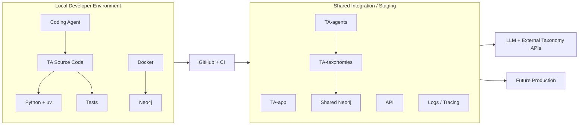
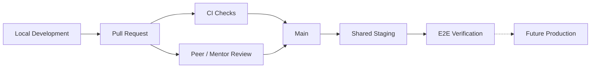
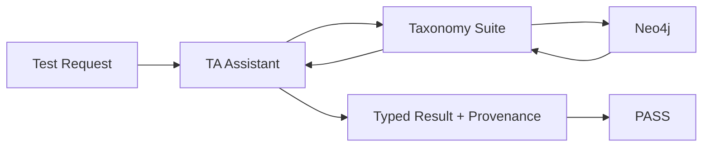

# Talent Angels — Development Environment & Deployment Architecture

**Audience:** Mentors, mentees, and future open-source contributors joining Talent Angels  
**LFX Mentorship 2026 — Talent Angels**  
**Sprint:** Sprint 3 — Resources  
**Deliverable:** Environment setup / design   
**Status:** **Draft for mentor review** — proposed architecture, deployment guideline, and verification plan; no shared infrastructure or spending is approved by this document.  
**Companion cost estimate:** [Infrastructure Budget Estimate](./Talent_Angels_Sprint3_Infrastructure_Budget_and_Funding_Strategy.md)

> **Purpose:** Describe how the Talent Angels team works consistently across independent computers, shared staging infrastructure, taxonomy resources, and large language model (LLM) services—with a **deployment runbook** and an **honest** statement of what verification means today vs later.

## 1. Objective

Sprint 3 asks the team to define a working environment for coordinated development:

> **A description of our working environment, with a guideline for deployment, and verification of its operation.**

The goal is not to make every contributor’s machine identical. It is to create a **reproducible Talent Angels development environment** where contributors can:

```text
Setup → Develop → Test → Collaborate → Integrate → Deploy → Verify
```

This design builds on the architecture from Sprint 2 and pairs with **Scenario B** in the [budget estimate](./Talent_Angels_Sprint3_Infrastructure_Budget_and_Funding_Strategy.md): shared mentorship staging on a **4 GB-class** server plus managed Neo4j, at roughly **$261.54/month** (~**$1,050** over four months gross).

**Crowdfunding, LOIs, and multi-sponsor outreach are out of scope for this document.** They are deferred until mentors validate the environment design and cost estimate.

> **Scope clarification requested:** The original Sprint 3 brief requested five initial funding submissions. The team subsequently proposed validating infrastructure requirements and budget estimates before sponsor outreach. Mentors are requested to confirm this revised sequence.

### Decision labels

| Label | Meaning |
|---|---|
| **Accepted** | Already established by the project / Sprint 2 |
| **Sprint 3 Proposal** | Recommended through this environment design |
| **Open Decision** | Requires team / mentor validation |
| **Temporary default** | Unblocks coordinated work now; may change without redesigning the stack |
| **Can wait** | Does not block day-to-day setup or PR flow |

---

## 2. Team topology (8 machines + 1 server)

**Sprint 3 Proposal — Server decision: YES**

| Role | Count | What it is for |
|---|---:|---|
| Mentee workstations | 4 | Day-to-day coding, local tests, local Neo4j / Docker |
| Mentor workstations | 4 | Same local path as mentees; review and demos |
| **Shared staging server** | **1** | Integration, shared graph/data, E2E demos, observability hooks |
| GitHub | 1 (org / repos) | Source of truth, pull requests (PRs), continuous integration (CI) |

```text
8 local machines (4 mentees + 4 mentors)
        │
        │  git push / pull request
        ▼
   GitHub + CI
        │
        │  merge to main → deploy (when automated)
        ▼
1 shared staging server  +  managed Neo4j (Scenario B)
        │
        ▼
Future production (out of immediate Sprint 3 implementation)
```

| Question | Answer |
|---|---|
| Where do contributors code day to day? | On their **local workstation** |
| What is the shared server for? | **Staging / integration only**—not daily feature development |
| Server size (cost pair) | **4 GB-class** shared compute (Scenario B ~$20/mo reference) — see [budget](./Talent_Angels_Sprint3_Infrastructure_Budget_and_Funding_Strategy.md) |
| Shared graph | Neo4j **AuraDB Professional 1 GB** for staging (local Docker Neo4j for development) |

---

## 3. Project structure

**Current workspace + Sprint 3 Proposal**

Talent Angels should remain modular rather than placing the entire system in a single repository. The structure below is a **proposal pending mentor review**; `TA-app` and `TA-taxonomies` are not represented as already-created repositories.

```text
LFX-Talent-Angels/
│
├── TA-app/
│   └── User-facing application
├── TA-agents/
│   ├── Main Talent Angels assistant
│   ├── Locate / Connect / Pathfind / Evaluate
│   ├── LangGraph orchestration
│   └── Agent tools
├── TA-taxonomies/
│   ├── Common taxonomy interface
│   ├── O*NET
│   ├── ESCO
│   ├── BLS
│   ├── SFIA
│   ├── JobTech
│   └── Lightcast (adapter / fixtures until partner or funded access)
├── TA-resources/
│   └── Shared resources / project assets
└── Infrastructure
    ├── Local development
    ├── Shared integration
    └── Deployment
```

Infrastructure definitions can live next to the components they support. A dedicated repository such as `TA-infra` can wait until infrastructure needs its own lifecycle.

**Open Decision (can wait):** final ownership / location of shared infrastructure configuration.

---

## 4. Overall environment architecture

Three levels:

1. **Local development** — independent contributor work.  
2. **Shared integration / staging** — team-wide integration and testing.  
3. **Production** — future public deployment (path only; not Sprint 3 build-out).



| Level | Primary use |
|---|---|
| Local | Feature work, agent/taxonomy implementation, unit tests, debugging |
| Shared staging | Combined components, shared datasets, E2E tests, demos, mentor validation |
| Production | Out of immediate Sprint 3 scope; design should not block a clean path later |

---

## 5. Local vs server service map

**Sprint 3 Proposal**

| Service / concern | Local workstation | Shared staging server | CI (GitHub Actions) |
|---|---|---|---|
| Source edit / IDE | Yes | No (not a remote desktop) | No |
| Python app / agents | Yes | Yes (deployed build) | Install + test |
| Docker Compose Neo4j | Yes (dev graph) | Optional self-host; prefer **managed AuraDB** | Service container or skip if mocked |
| Managed Neo4j (Aura) | Optional read-only if granted | **Primary shared graph** | Usually not; use fixtures |
| Taxonomy fixtures / subsets | Yes | Full or large subsets | Small deterministic fixtures |
| Live LLM API | Optional (personal / team keys) | For integration demos | **Mock where possible** |
| Secrets | Local `.env` (git-ignored) | Platform / host secrets | GitHub Actions secrets |
| Observability | Optional local | Shared logs / traces | CI logs only |

```text
Developer machine                          Shared staging
─────────────────                          ──────────────
Python components                          Deployed TA-app / API / agents
Docker → Neo4j (dev)                       AuraDB / shared graph
Dev taxonomy fixtures                      Larger shared datasets
LLM API (optional live)                    Live LLM for demos / E2E
Coding assistant (personal choice)         —
```

---

## 6. Standard contributor environment

| Area | Standard |
|---|---|
| Source control | Git + GitHub |
| Runtime | Project-defined Python version |
| Dependency management | `uv` / project standard |
| Local infrastructure | Docker + Docker Compose |
| Agent orchestration | LangGraph |
| Graph database | Neo4j |
| API | FastAPI where required |
| Testing | pytest |
| Configuration | Environment variables / `.env` |
| Project instructions | `AGENTS.md`, `CLAUDE.md`, architecture decision records (ADRs) / docs |

Contributors choose operating system, IDE, terminal, and AI coding assistant. **Contracts** stay shared: runtime, dependencies, configuration shape, tests, and verification targets.

```text
Same runtime contracts
+ Same dependencies
+ Same configuration
+ Same tests
+ Same verification target
= Reproducible development
```

### Newcomer first-day checklist

**Prerequisites (local machine):**

- Git  
- Project Python version (see repository docs when present)  
- `uv` (or the project’s documented dependency tool)  
- Docker Desktop (or Docker Engine + Compose)  
- OS: Linux, macOS, or Windows with a supported Docker path (WSL2 recommended on Windows)

**Steps:**

```bash
git clone <talent-angels-repository>
cd <repository>

# Target developer experience (names may match make targets later)
make setup          # or documented equivalent
cp .env.example .env
# Edit .env: local Neo4j password, optional LLM key — never commit .env

make dev            # or documented equivalent
make verify         # TARGET when implemented — see §10
```

Exact command names can evolve during implementation; contributors should not depend on undocumented manual steps. Until automation lands, follow the repository README / setup notes for the same sequence: **clone → install → configure → run local services → run tests**.

---

## 7. Infrastructure, taxonomies & LLM services

### Local infrastructure

**Sprint 3 Proposal**

```text
Developer Machine
│
├── Talent Angels Python components
├── Docker
│   ├── Neo4j
│   └── Vector persistence [if required]
├── Development taxonomy fixtures
└── External services
    ├── LLM APIs (optional live)
    └── Taxonomy APIs where applicable
```

Neo4j is the **Sprint 3 proposed** graph foundation, pending mentor review and an architecture decision record (ADR). Vector retrieval is required by the architecture; the implementation remains configurable.

**Open Decision (can wait for production quality):** Neo4j native vector indexing vs a separate store such as PostgreSQL / pgvector. **Temporary default:** benchmark Neo4j-native first so local and staging stay simple.

### Taxonomy environment

| Taxonomy | Access pattern | Development approach |
|---|---|---|
| O\*NET | Downloadable datasets | Local data / fixtures |
| ESCO | Dataset / API | Local subset + ingestion |
| BLS | Public data / API | API / cache / fixtures |
| SFIA | Access / licensing dependent | Permitted adapter only |
| JobTech | API / open data | API + fixtures |
| **Lightcast** | **Proprietary commercial data** | **Fixtures and/or partner-provided samples until funded or licensed access exists** — do not hard-require live Lightcast for local setup |

```text
External Taxonomy
       ↓
Download / API / fixture
       ↓
Ingestion / Normalisation
       ↓
Taxonomy Suite
       ↓
Neo4j / Retrieval
       ↓
TA-agents
```

Common taxonomy interface operations (illustrative):

```python
search_nodes(...)
get_neighbors(...)
enumerate_paths(...)
score_paths(...)
```

Use **small deterministic fixtures** for unit tests, **representative subsets** for local integration, and **larger datasets** on shared staging.

### LLM environment and roles

```text
TA-agents
    ↓
Model abstraction / configuration
    ↓
Selected LLM provider (config-driven)
```

| Role | Who / what | Notes |
|---|---|---|
| Coding assistant | Contributor’s choice on local machine | Outside project bill of materials |
| Runtime agent reasoning | Configured LLM provider for TA-agents | Main token cost driver (see budget) |
| CI | Mocks / recorded responses preferred | Avoid burning tokens on every PR |
| Staging demos | Live model when needed | Controlled keys; monitor usage |

**Temporary default (unblocks work):** an **efficient mid-tier / Flash-class** model for routine development, aligned with the **price reference** in the [budget estimate](./Talent_Angels_Sprint3_Infrastructure_Budget_and_Funding_Strategy.md) (Gemini 2.5 Flash **rates as reference only**—not a product lock-in). Premium models only where quality is measured to require them.

**Open Decision (can wait):** final default vendor and model name.

LLM tokens, shared compute, graph hosting, storage, and observability are the main **cost** items; details and Scenario B numbers live in the budget companion.

---

## 8. Configuration, secrets & security

```text
.env.example     → committed (placeholders only)
.env             → local and Git-ignored
CI secrets       → GitHub Actions secrets
Staging secrets  → deployment platform / host secret store
Production       → managed secret storage (future)
```

Example shape (no real secrets):

```dotenv
ENVIRONMENT=development
LOG_LEVEL=INFO

NEO4J_URI=bolt://localhost:7687
NEO4J_USERNAME=neo4j
NEO4J_PASSWORD=

LLM_PROVIDER=
LLM_MODEL=
LLM_API_KEY=

OBSERVABILITY_ENABLED=false
```

**Rules:**

- Never commit credentials or API keys.  
- Never put real-looking keys in examples or docs.  
- Use separate development vs shared credentials.  
- Inject secrets at runtime.  
- Keep environment-specific config outside application code.

---

## 9. Collaboration, CI/CD & deployment runbook

GitHub is the integration boundary between independent contributor environments.



### Minimum CI checks (target)

```text
Dependency installation
        ↓
Formatting / linting
        ↓
Static / type checks
        ↓
Unit tests
        ↓
Taxonomy contract tests
        ↓
Build / import verification
```

Mock LLM responses in CI where possible. Live-model evaluation belongs on staging or scheduled jobs, not every PR.

### Deployment runbook (guideline)

Short operational sequence for the team:

| Step | Action | Owner / place |
|---:|---|---|
| 1 | Develop and test **locally** (`make dev` / project equivalent, local Neo4j, fixtures) | Contributor workstation |
| 2 | Open a **pull request** with a clear description | GitHub |
| 3 | Ensure **CI** is green (lint, unit, contract tests; LLM mocked) | GitHub Actions |
| 4 | Obtain **peer / mentor review** | GitHub |
| 5 | Merge to **main** | Maintainer rights as agreed |
| 6 | **Deploy main → shared staging** (manual or automated pipeline once implemented) | Staging server |
| 7 | Run **smoke / E2E** against staging (shared graph + optional live LLM) | Team |
| 8 | **Future:** promote only after staging sign-off | Production (later) |

The shared server must **not** become the machine where everyone does day-to-day coding. It exists for integration, demos, and shared data.

---

## 10. Proposed environment verification plan (honest status)

Sprint 3 requires a description of verification—not a claim that production automation already exists everywhere.

### Target verification design

**Toolchain:** Python, dependency manager, Git, Docker.  
**Infrastructure:** Neo4j starts, connection succeeds, graph query executes; optional vector path works.  
**Components:** TA-taxonomies loads, taxonomy suite loads, TA-agents loads, LangGraph workflow compiles.  
**Semantic smoke (target):** request submitted → assistant routes → taxonomy suite invoked → retrieval succeeds → typed response + provenance.



**Target command (when implemented):**

```bash
make verify
```

### Example output — TARGET / ILLUSTRATIVE only

The following is a **design example** of what a future automated verifier should print. It is **not** a transcript of a run claimed by this Sprint 3 document.

```text
Talent Angels Environment Verification
=======================================

[PASS] Python environment
[PASS] Configuration
[PASS] Neo4j
[PASS] TA-taxonomies
[PASS] Taxonomy suite
[PASS] TA-agents
[PASS] Assistant workflow
[PASS] Semantic smoke test

Environment: READY
```

### What this submission does **not** claim

- That `make verify` already exists and PASSed in CI or on every machine  
- That production is deployed  
- That crowdfunding or sponsor requests were submitted  
- That live Lightcast or premium LLM quotas are provisioned  

Those items remain **planned engineering** or **post-validation funding** work.

---

## 11. Planned engineering artifacts (not missing proof of this doc)

§11 lists **planned** outputs for implementation sprints. Their absence does not mean this design document is incomplete; it means runtime automation is still to be built.

### Documentation (this deliverable + follow-ons)

- Environment architecture (this file)  
- Developer setup path  
- Local vs shared map  
- Taxonomy / data access strategy  
- Configuration / secrets guide  
- Deployment runbook  
- Verification procedure (target)  

### Technical implementation (later)

- `.env.example`  
- Docker / Compose configuration  
- Setup automation  
- Development fixtures  
- Verification script (`make verify` or equivalent)  
- CI checks  

Illustrative layout:

```text
infrastructure/
│
├── compose.yaml
├── .env.example
├── scripts/
│   ├── setup.sh
│   ├── verify.sh
│   ├── seed-dev-data.sh
│   └── reset.sh
└── docs/
    ├── local-development.md
    ├── deployment.md
    └── troubleshooting.md
```

Exact repository location remains an **Open Decision (can wait)**.

---

## 12. Decisions summary

### Established project direction

- Python ecosystem  
- Agent orchestration (LangGraph is the Sprint 3 proposal)  
- Graph foundation (Neo4j is the Sprint 3 proposal)  
- Taxonomy suite abstraction  
- Separate agent / taxonomy concerns  
- GitHub collaboration  
- AI-assisted local development (tooling choice left to contributors)  

### Sprint 3 proposal

- **8 local workstations + 1 shared staging server (YES)**  
- Local-first daily development  
- Reproducible containerised local dependencies  
- Shared integration / staging sized as **Scenario B** (4 GB-class + Aura 1 GB) — cost in [budget](./Talent_Angels_Sprint3_Infrastructure_Budget_and_Funding_Strategy.md)  
- Standard configuration contract  
- Automated environment verification as a **target** (see §10)  
- Development taxonomy fixtures (including Lightcast **fixtures** until licensed)  
- CI validation with mocked LLM where possible  
- Environment-specific secrets  

### Temporary defaults (unblock coordinated work)

| Topic | Temporary default |
|---|---|
| Shared server | **Yes** — one staging host |
| Server size | **4 GB-class** (Scenario B) |
| Shared graph | **AuraDB Professional 1 GB** for staging; Docker Neo4j locally |
| LLM class | **Efficient / Flash-class** (budget price reference only) |
| Vectors | **Neo4j-native first** |
| Observability | **Free / OSS first** |
| Lightcast | **Fixtures / partner samples** until access is funded or licensed |

### Open decisions that can wait

- Final cloud / hosting vendor (AWS, GCP, etc.)  
- Final LLM vendor and exact model ID  
- Infrastructure monorepo vs per-repo Compose  
- Paid observability product  
- Agent / session persistence technology  
- Final production deployment model  
- Neo4j vectors vs pgvector if native proves insufficient  

---

## Target outcome

```text
Contributor
    ↓
Clone & Setup
    ↓
Local Development
    ↓
Local Verification
    ↓
Pull Request
    ↓
CI + Review
    ↓
Shared Integration (Scenario B staging)
    ↓
End-to-End Verification
```

The objective is not an enterprise platform prematurely. It is a **reproducible, testable, and deployable** engineering environment for the mentorship team today and a clean foundation for future open-source contributors—paired with a mentor-reviewable **[~$1,050 / 4 months gross, $1,500 envelope]** cost model in the [budget estimate](./Talent_Angels_Sprint3_Infrastructure_Budget_and_Funding_Strategy.md).
